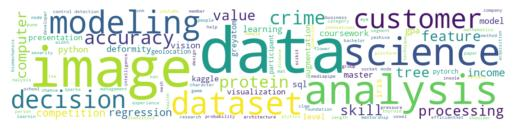

# Resume to Wordcloud

Converting a resume to wordcloud to identify if the resume is a better fit for the position

# Concepts

Word Net Lemmatization: Word net is a big corpus of words with lemmatized words which can be used to convert words to there lemmatized form using morphological analysis. For ex: rocks : rock

Stop words: To remove stop words from the data. For ex: To, here.

POS tagging: Using Past of speech tagging. Used NN: common singular nouns, NNS: common, plural nouns, RB: Adverb.

# Usage

Install the required libraries

`pip install -r requirements.txt`

# Output

# Future work

Creating an LSTM model to suggest the words to detect and replace the words for the resume.
